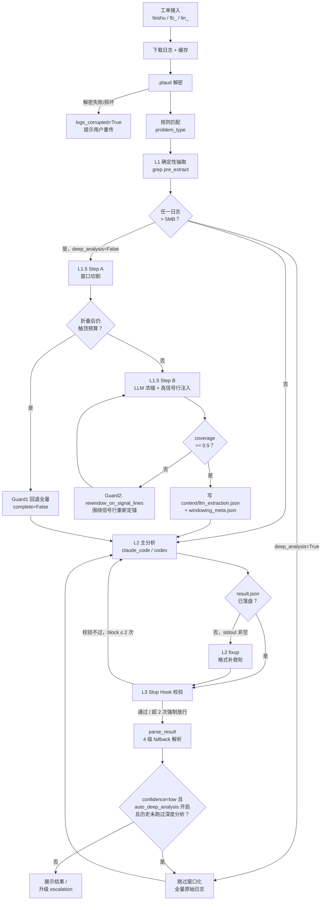

# 工单分析机制 —— 内部设计详解

> 面向读者：工程师 + AI（Claude Code / 其他 agent）。目的是讲清楚工单分析 pipeline 每一环节**是什么**、**为什么这样设计**，尤其是 L1 / L1.5 / L2 / L3 这类容易搞混的分层概念。
>
> 与 [`ticket-analysis.md`](./ticket-analysis.md) 的关系：那份是模块地图 + API 速查，这份是设计动机与踩坑历史的深度记录。改动 pipeline 前建议先读这份，尤其是"为什么"部分——很多看起来可以简化的逻辑，都是真实故障复盘后加的护栏，删掉会复发旧问题。
>
> 引用格式 `file.py:123` 均对应本文写作时的代码行号，改动后可能漂移，以代码为准。

---

## 0. 一句话概览

```
工单(飞书/本地/Linear) → 下载日志 → 解密 → 规则匹配(L1路标) → 确定性抽取(L1) →
窗口化+LLM浓缩(L1.5) → 编排选 agent → 主分析(L2) → 格式补救(L2 fixup) →
Stop Hook 校验(L3) → 结果解析(4级 fallback) → 展示/升级(escalation)
```

分层命名速查表（本文档反复使用，先记住这个表，后面每节都是在回答"这一层为什么存在"）：

| 层 | 名字 | 是什么 | 解决什么问题 |
|----|------|--------|-------------|
| — | 规则匹配 | 关键词/正则命中 `backend/rules/*.md`，选出 `problem_type` | 给工单分类、给后续步骤指路 |
| **L1** | 确定性抽取 | 用规则里的 grep pattern 在原始日志里跑 `grep`，纯规则、不过模型 | 把几十 MB 日志压成 KB 级结构化证据，且不会被模型"看漏/编造" |
| **L1.5** | 窗口化 + LLM 浓缩 | 先按时间窗口切原始日志（确定性），再用小模型（Haiku）通读窗口提取结构化上下文 | 日志太大主分析模型读不完/太贵；但切窗口本身有丢证据风险，这层的大部分复杂度都在"怎么切不丢证据" |
| **L2** | 主分析 agent | Claude CLI / Codex CLI 真正做根因分析的那一轮 | 产出 `root_cause` / `fix_suggestion` 等结构化结论 |
| **L2 fixup** | 格式补救轮 | L2 说完了但忘了把结果写成 JSON 时，起一个廉价子任务做"格式转正" | 模型偶尔只把结论讲在对话文本里，没调 Write 工具落盘 |
| **L3** | Stop Hook | L2 每次想结束会话时，先跑校验脚本检查 `result.json` 是否合法、是否是占位话术 | 防止"分析中，请稍后"这种半成品被当作正式交付结果放行 |

### 0.1 流程图



> 图中省略了 Zendesk 导入、规则热加载、追问 window_scale 放宽等旁路，完整细节见对应正文小节。

---

## 1. 工单来源与路由

### 1.1 三种来源，各服务不同的人

```python
# backend/app/workers/analysis_worker.py:317-318
is_local = issue_id.startswith("fb_")    # 本地表单
is_linear = issue_id.startswith("lin_")  # Linear webhook
# 其余（无前缀，如 recXXXXXX）走飞书多维表
```

| 前缀 | 来源 | 服务谁 | 为什么需要它 |
|------|------|--------|-------------|
| （无）`recXXXXXX` | 飞书多维表 | 客服/QA 团队原有工单登记系统 | 这是"存量"渠道，客服团队本来就在飞书里管工单，不能推翻重来 |
| `fb_` | 本地表单 `/feedback` | 不用飞书多维表的用户 | `backend/app/api/feedback.py:1-4` 注释："Submitting feedback immediately triggers AI analysis"——不用先在飞书建记录，提交即分析，减少一次人工搬运 |
| `lin_` | Linear webhook `@ai-agent` | 研发/工程侧 | 让工程师留在自己已有的 Linear 工作流里直接触发分析，结果回评论，不用跳去飞书 |

`fb_`/`lin_` 两类工单在各自的 webhook/API 里已经落库，pipeline 直接读本地 DB；飞书工单是实时拉取（`FeishuClient().get_issue()`），因为飞书多维表本身就是数据源，没有必要在本地二次落库再读。

### 1.2 Linear 触发条件：为什么必须显式 `@ai-agent`

`backend/app/api/linear_webhook.py` 只监听 `Comment(create)` 和 `Issue(create)` 两种事件，且**必须命中触发词**才会跑分析（`linear_webhook.py:98-140`）。`@ai-agent-followup`（追问）是 `@ai-agent` 的前缀词，必须先判断追问再判断首次触发，否则追问会被误判成新分析（`linear_webhook.py:38-40`）。

代码里没有直接写"为什么不自动跑全部 Linear issue"的注释，但设计意图很明显：Linear 上大多数 issue 是常规研发任务，不是"设备日志分析"场景。如果自动跑全部，等于对每条新 issue/评论都触发一次下载+解密+agent 分析，成本高且大概率没有可分析的日志附件。显式 `@ai-agent` 相当于一个"确认信号"，只在工程师主动想要时才跑，同时避免和 Linear 上其他 bot/webhook 抢事件。

### 1.3 飞书附件下载：缓存 + 容错

- 下载目标：`workspace/<task_id>/raw/`，同时维护一层按 `issue_id` 的全局缓存 `_cache/<issue_id>/raw/`（`analysis_worker.py:402, 424-461`）。命中缓存直接拷贝，不重新调飞书 API；缓存有 `max_issues=500` 的容量上限清理。
- 单个附件下载失败只记 `logger.error`，不中断整单分析（`analysis_worker.py:445-449`）——设计取舍是"缺一个文件不该让整单分析失败"。

### 1.4 Zendesk 关联：辅助录入，不是分析数据源

容易搞混的一点：Zendesk **不在**自动分析 pipeline 里，只在 `POST /api/feedback/import-zendesk`（`backend/app/api/feedback.py:206-251`）这一个入口被用到——客服提交本地表单前手动点"从 Zendesk 导入"，拉工单详情+最近 50 条评论，用 ChatGPT 摘要后反填表单字段（`description`/`category`/`priority` 等），本质是帮客服省录入时间，**不会被分析 agent 拉取会话内容**。`zendesk_id` 只是存进记录用于展示和升级消息里带一条链接。

### 1.5 `.plaud` 解密：格式混淆，不是强加密

- `.plaud` 是设备/App 端自定义容器：4 字节明文 magic + ChaCha20 加密体，解密后是个 ZIP，内含 `plaud.log`（当前会话）+ 滚动备份日志（`backend/app/services/decrypt.py:21-28, 166-218`）。
- 密钥是**硬编码固定密钥**（`CHACHA20_KEY`/`CHACHA20_NONCE`，`decrypt.py:21-22`），客户端服务端共享同一份，不按用户/设备派生。也就是说这层"加密"的作用更多是格式混淆（避免明文日志被随手打开/转发链路损坏时被误当普通文本处理），不是按用户隔离的安全加密。
- 失败处理区分两种语义：
  - 本来没日志附件 → `has_logs=False`
  - 有附件但解不开（非法 ZIP/找不到 `.log`）→ `has_logs=False` 且 `logs_corrupted=True`（`analysis_worker.py:546-550`），走"提示用户重传"分支，而不是让 agent 拿着空数据瞎猜根因。
  - 上传时如果 CRLF 注入等原因导致 magic 字节偏移，`_strip_pollution_prefix()` 会在前 16 字节内找 magic 剥掉前缀自愈（`decrypt.py:141-163`）；完全找不到 magic 的文件直接在上传阶段 400 拒收（`feedback.py:87-110`）。

---

## 2. 规则系统 —— 分类 + 给 L1 指路

`backend/app/services/rule_engine.py` + `backend/rules/*.md`。

### 2.1 规则文件长什么样

Frontmatter 关键字段（schema：`backend/app/models/schemas.py:184-206`）：

| 字段 | 语义 |
|------|------|
| `triggers.keywords` / `triggers.priority` | 关键词命中列表 + 优先级（多规则都命中时排序用） |
| `depends_on` | 依赖的其他规则 id，命中后一并拉入上下文 |
| `pre_extract` | `[{name, pattern, date_filter}]`，L1 抽取用的 grep pattern 列表 |
| `needs_code` | 是否需要把代码仓库软链进 workspace 供 agent 读源码 |

真实例子（`backend/rules/bluetooth-connection.md`）：`priority: 8`，关键词中英混合（蓝牙/bluetooth/ble/tokennotmatch/FindMy），`pre_extract` 里一条 pattern 是 `"tokennotmatch|TokenNotMatch|token.*not.*match"`——同一现象在日志里可能有多种措辞，规则要全部覆盖，不能只写一种大小写/语言。

### 2.2 匹配语义

- 关键词匹配对纯字母数字加词边界正则（防止 `connect` 命中 `connection`），中文场景没有词边界概念，退化为子串匹配（`rule_engine.py:170-183`）。
- 排序键是 `(priority, hit_count, max_kw_len, rule_id)`，`classify()` 只取第一名作为 `problem_type`（无命中则 `"general"`），这个值写入 `AnalysisRecord.rule_type`，是后续规则准确率统计的分组维度。
- `match_rules()` 不只取 top1，而是取最多 3 条候选规则 + 各自的 `depends_on`——因为一张工单经常同时命中多个现象（比如"录音丢失"和"蓝牙断连"同时出现），需要把相关规则都打包给 agent，不能只信排名第一。

### 2.3 为什么"启动时全量同步进 DB，运行时走 DB"而不是直接读文件

模块头部注释直接给了答案：「On startup: load rules from files → sync to DB (file rules are seed data)；Runtime: DB is source of truth」。关键考量在 `sync_files_to_db()` 的注释（`rule_engine.py:91-96`）：**DB 里的规则只有文件版本号更新时才会被覆盖**，"so deliberate UI edits are not overwritten by older seed data"——即运营/工程师可以在 `/rules` 页面直接改规则（存 DB），这些改动不会被下次部署重新拉起的 md 文件覆盖；文件依然是"种子数据"，保留版本控制和灾难恢复能力（DB 丢了能从文件重新 seed）。运行时走内存 cache 而不是每次查文件/DB，是纯粹的性能考量——工单进来时的匹配必须是内存操作，不能扛文件 IO 或 DB round-trip。

### 2.4 热加载 `/api/rules/reload`

做的事：`engine.reload()`（重读 md 到内存）→ `engine.sync_files_to_db()`（同步新版本 + 刷新内存 cache）。存在的原因：工单分析是长期运行的 worker 服务，改规则后不能要求重启（会打断正在跑的任务），也要支持"UI 编辑规则后立刻对下一张工单生效"的场景。

---

## 3. L1：确定性抽取 —— "别让模型看漏，也别让模型编"

函数：`backend/app/services/extractor.py::extract_for_rules()`，紧跟规则匹配之后跑（`analysis_worker.py:612-619`）。

模块头注释是最好的"why"：「This is the deterministic layer (L1) that reduces multi-MB logs to structured KB-sized data before sending to the LLM Agent.」——核心目的两个：

1. **省 token/成本**：把几十 MB 日志压到 KB 级再进 LLM。
2. **保真**：纯规则匹配是确定性的，不会像 LLM 摘要那样"看漏"关键证据或"脑补"不存在的内容。

实现上对每条规则的每个 `pre_extract` pattern 跑 `grep -E "<pattern>" file | tail -n 200`（`date_filter: true` 时先按日期过滤再 grep）。**注意是 `tail` 不是 `head`**——`extractor.py:34-37` 的注释记录了真实故障 `fb_08344bb236`：旧逻辑取最前 200 条，被一次性历史事故占满，真正近期的故障反而没进 L1 抽取。这是一条"看起来微不足道但改错方向就会复发故障"的细节。

L1 结果不只是"给 agent 看的摘要"，还被 L1.5 窗口化当作**正确性校验的 ground truth**（见第 4.3 节）——这是 L1 最容易被低估的一个作用：它既是输入压缩，也是下游"窗口切没切对"的验证基准。

另外 workspace 里给 agent 的说明（`rule_engine.py:340-358`）明确要求"不信任预提取：预提取摘要仅用于定方向，关键证据必须从 `logs/` 目录 grep 验证"——L1 抽取是路标，不是终审证据，避免 agent 偷懒直接照抄。

---

## 4. L1.5：窗口化 + LLM 浓缩 —— 全文档最厚的一层，因为这里踩过真实事故

这是历史上唯一一层被"AI 好像变笨了"的用户投诉直接打回来重做过的部分。**如果只记住本文档一件事，记住这条：日志太大要裁剪，但裁剪本身是有损操作，裁掉了关键证据，agent 分析质量会断崖式下跌，且现象是"结论看起来很自信但是错的"，而不是报错——这比不裁剪更危险，因为不会主动暴露问题。** 下面每个子机制都是在堵一种"裁剪丢证据"的具体失效模式。

### 4.1 为什么需要这一层

主分析 agent（L2）用大模型做根因判断，虽然 Claude CLI 支持到 1M context，但成本和分析轮次都会随日志体量线性上升。L1.5 用便宜的小模型（Haiku）先通读窗口化后的日志，产出结构化上下文（`context/llm_extraction.json`），让 L2 的 prompt 里明确写"已有人读过日志替你提炼了重点，你应该优先信任这些上下文，减少重复 grep"（`base.py:181-191`），从而把 L2 的分析轮次和 token 消耗压下来。

### 4.2 Step A：窗口切割（`log_windower.py::window_log_file`）——确定性、零成本

**锚点策略**：以 `problem_date` 为主锚点（来源：`issue.occurred_at` 优先，其次从工单描述正则抠日期，`issue_text.py::guess_problem_date`）。这条策略是 2026-06-11 用户拍板定下的（见下方"演进历史"），**故意弃用**了"错误密集窗口"（error-dense）和"L1 抽取时间推断"作为默认锚点——理由：用户是出事后才来报的，日志里"最近"的时间段通常比"错误最密集"的时间段更贴近真实故障现场；旧启发式容易锚到半年长日志里的陈旧区段。`find_error_dense_window()` 函数体还在，但已经是死代码（仅测试引用），不再驱动默认路径。

**空窗回退**：`problem_date` 落在空窗（`no_lines_in_window`）时，**不会**回退到全量原始日志，而是重新围绕"日志最近的活动"切一个有界窗口（`log_windower.py:297-301` 注释直接引用真实事故 `rec27zFZSkfFpN`：42MB/半年日志，`problem_date` 落空洞，旧逻辑回退全量 → agent 从最老的行开始啃 73 万行 → 600 秒超时）。

**重复模板折叠**（`DEFAULT_MAX_PER_TEMPLATE = 200`）：把日志行归一化（去时间戳/数字/hex）后按模板计数，超过 200 次的模板只留一条 marker。存在的原因：某些结构化 payload（比如逐行打印的 transcript JSON，用 `║ "start_time"` 这种框线格式）会把窗口预算全部吃掉，导致真正的、更晚发生的关键事件被截断丢弃——这正是本文档开头提到的那次真实投诉（`fb_56427d576f`，用户报"服务器 AI 像降智"）的根因：10:54-10:58 的重复 JSON 风暴吃光了 200K 行预算，11:08 的 `BleState.connected` 被截断，agent 只看到早先的"蓝牙权限"误报，而真因其实是 SD 卡写入权限被拒。

**完整性兜底**：折叠之后如果仍然触顶 `max_output_lines`，说明窗口大概率被截断到不完整（`incomplete_after_folding`），此时**回退全量原始日志**并标记 `metadata["complete"]=False`——这是唯一还允许"裸退全量"的路径，原则是"一个证明不完整的窗口，比全量日志更危险，因为它看起来完整实际上缺了尾巴"。

### 4.3 Step B：LLM 浓缩（`context_condenser.py`）—— 高信号行必须 verbatim 注入，不能靠采样赌运气

早期方案是"折叠重复模板 + 跨窗口均匀 stride 采样"塞进浓缩 prompt。这个方案后来被真实语料回放**证伪**：14 张工单回放显示 L1 高信号行留存率中位数只有 ~30%，个别 0%，有时比更早的"直接读文件头部截断"方案还差——采样预算太小，稀疏的关键证据行很容易被采样跳过。

现在的做法（`_build_signal_block`，`context_condenser.py:98-122`）：L1 规则 grep 命中的高信号行（`signal_lines_from_extraction`）去重后**逐字（verbatim）注入 prompt 开头**，采样/折叠后的日志正文只作为背景补充。函数注释：「These lines are guaranteed to reach the prompt regardless of sampling, because L1 already identified them as relevant — far more reliable than hoping a uniform sample of a multi-MB log lands on a sparse single line.」回放验证：18 张工单，纯采样 L1 覆盖率中位数 ~30%，改为注入后 91-100%。

一句话教训（写进了当时的 commit message，值得记录）：**"我们已经知道哪些行相关，就直接把它们喂给模型"永远比"靠采样碰运气"更可靠**。折叠+均匀采样逻辑没有被删除，仍然存在，只是降级为"信号行注入之后，给剩余日志正文兜底"的次要角色。

### 4.4 双重完整性校验：Guard 1（文件级）+ Guard 2（覆盖率级）

这是两种**正交**的失效模式，必须分开校验：

- **Guard 1（4.2 节的完整性兜底）**：窗口"太密"——折叠后仍然装不下，说明预算不够，窗口物理上不完整。
- **Guard 2（`window_coverage_ratio`，`analysis_worker.py::_run_context_condensation` 里阈值 0.5）**：窗口"选歪了"——即使窗口本身没触顶，如果 L1 已经确认的高信号行里，落在窗口范围内的比例低于 50%，说明 `problem_date` 这个锚点大概率猜错了，真正的证据根本不在当前窗口的时间范围里。

触发 Guard 2 之后的动作演进过一次，值得专门记录：

> 2026-06-11（commit `5e49e33`）先把"空窗回退全量"堵掉了（4.2 节），但当时"低覆盖率回退全量"这条路径还没堵——`problem_date` 主锚点策略和 coverage guard 之间有冲突没解决，commit message 里明确留了 TODO。
> 2026-06-12（commit `de77254`，只隔一天）补上了：低覆盖率时改用 `rewindow_on_signal_lines()`——围绕 L1 高信号行自己的时间戳中位数重新定锚，重切一个新的有界窗口把证据包回来；如果信号行完全没有可解析时间戳，则退化为"锚最近"。**至此两条"裸退全量"的路径全部堵死**，跨月超大日志不会再有任何路径被原样丢给 agent。

写这段历史是因为：如果你在代码里只看到当前状态，会觉得"这套 guard 设计得很完备"，但实际上是两次事故驱动的迭代式补丁，理解这个过程有助于判断"新加一种裁剪策略时，我是不是又在重复某个已经踩过的坑"。

### 4.5 追问（follow-up）场景的窗口放宽

工单第一次分析后用户追问，如果每次追问都用和首次分析一样的窗口，看到的日志范围完全相同，挖不出新证据。`_run_context_condensation` 支持 `window_scale` 参数：第 1 次追问窗口 ×2，第 2 次 ×4，第 3 次直接切到全量原始日志（复用深度分析的跳窗路径），同时把锚点文本从"仅工单描述"扩展为"描述 + 历史追问 + 本次追问"组合重新定位。

### 4.6 深度分析模式：另一条独立的"不裁剪"通路

`deep_analysis=True` 时完全跳过窗口化，把完整原始日志直接交给 agent（`analysis_worker.py:927-934`），`max_turns` 也放宽到 40、`log_read_cap` 放宽到 30（`agent_orchestrator.py:135,143,174,182`）。和上面这套自动窗口化逻辑是两条独立路径，不要混淆"deep_analysis 跳窗"和"低覆盖率回退全量"（4.4 节），后者已经被堵死，前者是显式选择。

深度分析有两个触发入口，不只是人工点按钮：

1. **人工触发**：用户在前端主动点"深度分析"。
2. **自动升级**（`api/tasks.py::_maybe_trigger_auto_deep_analysis`，配置开关 `AUTO_DEEP_ANALYSIS_KEY`）：常规分析给出 `confidence=low` 时，按开关自动重跑一次深度分析，等价于自动替用户点了那个按钮。

自动升级有一层专门的幂等闸门，是踩过生产事故后加的：只挡"这次调用是不是深度分析"不够——因为任何重新进入分析流程的入口（`/api/tasks`、`feedback.py` 等）都不受那个局部参数约束，必须去查该 issue **历史上**是否已经有 `is_deep_analysis=True` 的分析记录，只要有过就不再自动升级。原因写在注释里：不然深度分析结果依然是 `low` 时会无限递归升级（真实生产事故 `fb_865f6d2f15`，2026-08-07）。

### 4.7 排错口诀

以后再遇到"服务器分析结果和本地不一样""AI 好像变笨了"，**先怀疑证据是否被裁剪丢了，别先怀疑模型/prompt**。核实方法：读 `workspaces/<task_id>/context/windowing_meta.json`，对比 `kept_lines` vs `total_lines`，看 `complete` 字段，看 `reason` 字段（取值包括 `below_size_threshold` / `no_lines_in_window` / `insufficient_reduction` / `incomplete_after_folding` / `low_l1_coverage_recentered`），确认窗口的实际时间跨度是否覆盖了用户描述的故障时间点。

---

## 5. Agent 编排与执行

### 5.1 为什么要抽象 `BaseAgent`

`backend/app/agents/base.py` 定义的 ABC 只强制一个方法：`analyze(workspace, prompt, on_progress)`。当前注册了三种实现（`agent_orchestrator.py:28-32`）：`claude_code`（CLI 子进程）、`claude_api`（直接调 Messages API）、`codex`（Codex CLI 子进程）——三者的 I/O 方式完全不同，但上层 pipeline 只关心"给 workspace + prompt，拿回结构化结果"。把"怎么造 prompt"（`build_prompt`/`build_prompt_with_meta`）和"怎么解析结果"（`parse_result`）做成基类共享的静态方法，避免三份重复实现，也保证三种 agent 最终输出的 JSON 契约字段一致。

### 5.2 路由：为什么不是简单的"一个 problem_type 对一个 agent"

`agent_orchestrator.py::select_agent` 的优先级链（从高到低）：

1. 显式 `override`
2. **超大 prompt 强制路由**：`prompt_chars` 超过阈值（默认 500K 字符）时无视其他规则强制走 `claude_code`——因为 CLI 支持 1M context，API 侧只有 200K，注释里提到约 1.2% 的超大日志工单在 API 侧会直接装不下。
3. `call_mode` 概率分流（API/CLI 按比例走）
4. `agent.routing[rule_type]`（`config.yaml` 配置的路由表）
5. `agent.default` 兜底

此外还有一套**独立**的配额熔断机制：命中 `_QUOTA_EXHAUSTED_TYPES` 时走 `_FALLBACK_MAP`（`claude_code→codex`、`claude_api→codex`、`codex→claude_api`）自动切厂商——这是运行时故障转移，和上面"路由到 default agent"是两套不同的兜底，设计文档/代码注释里也特意强调不要混为一谈，因为排查时如果搞错会误判成"路由表配错了"。

### 5.3 L1.5 上下文怎么进 L2 的 prompt

`build_prompt_with_meta` 按 `condensation_context is not None` 分两种模式，措辞刻意不同：

| | L1.5 mode | Standard mode（无 L1.5） |
|---|---|---|
| 对 agent 的指令基调 | "已有大 context 模型读完整日志提炼了重点，优先基于这些上下文分析，减少重复 grep，目标 10 轮内完成" | "列 3-5 个假设，主动 grep `logs/` 验证（至少 3 次）" |
| `context/` vs `logs/` | `context/` 优先，`logs/` 仅在需要补充时才 grep | 直接说"`logs/` 可以直接 grep"，没有优先级暗示 |

两种模式的措辞差异是**故意为之**：如果 L1.5 已经浓缩了上下文，但 prompt 仍然像 Standard mode 一样鼓励 agent 大量重新 grep，等于 L1.5 白做了，省下的 token 又在 L2 轮次里花回去。

---

## 6. L2：主分析执行细节（`claude_code.py`）

### 6.1 子进程调用关键参数

`claude -p --output-format json`，加上按配置追加的 `--model`（如 `claude-sonnet-5[1m]`）、`--effort high`、`--fallback-model`（1M context 过载时自动降级 200K）、`--max-turns`（常规 25，`deep_analysis=True` 时放宽到 40，见 `agent_orchestrator.py:135,174`）、`--allowedTools`（白名单只有 `Read/Write/Grep/Glob` 加几个只读 shell 命令如 `grep/wc/head/tail/sort/awk/sed/cat/zcat/gunzip`——**没有 `rm` 或任何写文件类 shell 命令**，只放开分析必需的只读检索能力）。Prompt 通过 stdin 传入而非命令行参数，避免超长 prompt 撞 argv 长度限制。

### 6.2 双线超时：总超时 + stall 看门狗

- **总超时**：由外层 pipeline 超时减去安全余量推导而来，且故意比外层 `asyncio.wait_for` 的硬墙更早触发——如果让外层先 cancel，已经落盘的部分结果会被直接丢弃，提前用软超时收尾可以 salvage 已有产出。
- **stall 看门狗**（默认 420s）：专盯 `result.json` 的 mtime，连续不更新判定"某一轮卡死"，主动 kill 并 salvage。这个阈值本身是踩坑调出来的——早期设 240s 太激进，会误杀正在长时间 grep 的正常轮次（真实 case：`fb_17b4fa0293`/`fb_b47f129711`）。

### 6.3 L2 格式补救轮（"L2 fixup"）

触发条件：主分析进程正常结束、`output/result.json` 不存在、且 stdout 非空且长度 > 200 字符。做的事：起一个**独立、极简**的新 CLI 子进程（`--max-turns 3`、纯文本输出、60 秒超时、工具白名单仅 `Write/Read/Bash`），prompt 明确要求"不要重新分析、不要 grep，只做格式转换，把之前的 Markdown 转写成 schema JSON 用 Write 落盘"。

为什么需要这个兜底：代码注释直言——「AI 已经把分析想清楚了（stdout 里有完整 Markdown），只是忘了调用 Write 工具落盘」。这是模型行为的不确定性（偶尔把结论只讲在最终回复文本里），不是逻辑 bug，日常运维层面用一个几乎不耗资源的小任务补救，比直接退化到"纯正则从 Markdown 硬抠字段"（见第 7 节策略 4）质量更高。

### 6.4 L3：Stop Hook —— 防止"分析中，请稍后"被当成正式交付

写入 workspace 内 `.claude/settings.json` 的 Claude Code 原生 Stop hook：模型每次想结束会话，hook 先跑校验脚本检查 `output/result.json`——不存在 / 非法 JSON / 内容命中"分析中/in progress/稍后回复"等占位话术 / `root_cause` 少于 40 字符——任一命中就返回 `{"decision":"block"}` 强制模型再来一轮补写。为避免死循环，block 次数封顶 2 次，超过就放行交给下游解析兜底；脚本内部任何异常也 fail-open 直接放行（校验脚本自己的 bug 不能反过来卡死模型）。

这个设计同样是踩坑后加的：旧版本只检查文件是否存在，导致过占位结果（"Analysis in progress... pending further grep"）完全合规地通过退出闸门，被当成正式结果交付给用户（真实 case：`fb_b47f129711`）。

---

## 7. 输出解析：4 级递降 fallback

`base.py::parse_result`，每一级对应一种"agent 输出不稳定"的实战坑：

1. **策略 1**：读 `output/result.json`，JSON 解析失败先尝试截断修复（在报错位置截断、去掉尾部逗号、补 `}`）——应对进程被 `max_turns`/超时中途 kill、JSON 写了一半的情况。
2. **策略 2**：`workspace.rglob("result.json")` 递归找其他路径下的候选文件——应对 agent 没按约定路径写文件。
3. **策略 3**：从 stdout 正则找 ` ```json ` 代码块或配平的 `{...}` 括号块——应对 agent 只在回复文本里输出了 JSON、没真正调 Write 落盘。
4. **策略 4**：`_salvage_from_markdown` 纯正则/关键词分段硬抠字段——最后兜底，明确排除了一批章节标题词（"Root Cause"/"根本原因"/"Summary"等），因为踩过 `fb_df8889bcff` 的坑：曾经把第一个非无效标题误当成 `problem_type`，把结构标签当成了问题分类。

**这套 fallback 存在的根本原因**：CLI 非交互模式下无法用强 schema 约束模型输出，只能在多个环节（L2 fixup、L3 Stop hook、上面 4 级解析）逐层降低"最终走到策略 3/4"的概率，是纵深防御，不是单点方案。

解析成功之后还有独立的质量二次校验，不要和"解析失败兜底"混为一谈：截断检测（`root_cause`/`root_cause_en` 结尾不是终止标点 → 强制标 `system_failure=True` 且 `confidence` 拉回 `low`）、英文字段翻译缺失检测（`*_en` 字段中文占比超过 30% → 记录告警）。前者是"有没有解析出内容"，后者是"解析出的内容能不能信"，是两类不同的问题。

---

## 8. 工单升级（escalation）

### 8.1 具体动作

`create_escalation_group()`（`backend/app/services/feishu_cli.py`）：

1. 群名 `Appllo-Ticket-{分类}-{日期}`。
2. 拉人名单 = 本周 oncall 轮值组 + 固定成员配置 + 触发升级的那个人。
3. 建飞书群，邮箱转 open_id 批量拉群；生成永久有效邀请链接兜底（默认邀请链接 7 天失效，升级群需要长期可点）。
4. 群里发结构化消息：工单链接/描述/分类/Zendesk 号 + @ 本周 oncall + 一段"问题分类 → owner"路由表。
5. 无论群是否建成功，都会给名单里每个人发一条私信兜底通知——群创建失败不能让通知也一起失效。

### 8.2 为什么消息模版统一用英文

本地表单的描述会拼成 `[平台][中文分类标签] 用户原文`。转发到升级群前用正则把 `[xxx]` 前缀去掉，只留用户原始描述——代码注释直接写明："Strip leading [Platform][Chinese category] prefix so only English user description shows"。目的是让工程侧（很多是英文/跨国团队）看到的是干净的用户原话，而不是中文分类标签；消息模版整体也统一英文，避免中英混排。

### 8.3 与 oncall 模块的关联

拉群名单的 oncall 部分来自 `get_current_oncall()`，底层按"值班组列表 + 起始日期 + 当前日期算第几周"做每周轮转，且**当周一旦生成快照就冻结**——后续改值班组配置不会让已经过去的周重新计算，换组时从最近一次冻结锚点续轮而不是对绝对周数取模跳变（避免改配置那一刻所有历史周的归属突然集体跳变）。

除了人工点击升级，还有一条**自动**通知路径：分析完成后检测"疑似复发"（新工单命中版本 ≥ 之前标记已修复的版本），命中且未被限流（生命周期内一次 + 12 小时频率上限）时私信当周 oncall——这条路径不建群，只私信，和"人工转交建群"是两条独立但共享同一个 oncall 名单来源的通知路径，避免各自维护一套"该通知谁"的逻辑导致两边不一致。

---

## 9. 规则准确率反馈（人工看板，非自动闭环）

`backend/app/services/rule_accuracy.py` 按 `AnalysisRecord.rule_type` 关联工单状态，统计每类规则命中的工单里"人工确认准确"与"标记不准确"的比例、平均置信度。这是规则系统和结果质量之间唯一的直接关联点，为工程师判断"哪个规则文件该优化"提供数据依据，**但这是人工看板，代码里没有发现自动写回规则文件/DB 的闭环**——发现某类规则准确率低之后，还是要人工去改对应的 `.md` 文件。

---

## 10. 前端设计取舍（简要）

详细页面/端点见 `ticket-analysis.md`，这里补充两条"为什么"：

- **工单 ID 必须带前缀展示**（`fb_xxx`/`lin_xxx`/无前缀）：因为前缀本身就是路由依据（第 1.1 节），用户复制粘贴 ID 时如果丢了前缀，后端会路由错来源。
- **详情面板在 `/` 和 `/tracking` 各写一份、互相独立**：这是已知的技术债（`ticket-analysis.md` 里标了 TODO 抽共享组件），不是有意设计，改面板交互记得两处都要改，只改一处会出现"一边改了另一边没变"。

---

## 11. 配置阈值速查表

散落在各节里的数字统一汇总到这里，改阈值前先看这张表，避免漏改联动的另一处。

| 阈值 | 默认值 | 位置 | 含义 |
|------|--------|------|------|
| L1 grep 单模式最大命中行数 | 200（`tail -n 200`） | `extractor.py` | 每条 pattern 只保留最新 200 条命中，防止历史事故占满 |
| L1.5 触发条件（单文件大小） | 5.0 MB | `config.py:235`（`ContextCondensationSettings.log_size_threshold_mb`） | 所有日志都 ≤ 5MB 时直接跳过窗口化+浓缩，进 L2 前不做任何裁剪 |
| L1.5 窗口跨度 | problem_date 前 4h / 后 2h | `config.py:236-237` | `time_window_hours_before/after`，默认窗口大小 |
| 窗口输出行数硬顶 | 200,000 行 | `log_windower.py:110` | 触顶且折叠后仍超 → Guard1 回退全量 |
| 重复模板折叠上限 | 200 次/模板 | `log_windower.py:26` `DEFAULT_MAX_PER_TEMPLATE` | 超过只留一条 marker，防日志风暴吃光预算 |
| 窗口大小判定阈值 | 5 MB | `log_windower.py:46` `DEFAULT_SIZE_THRESHOLD` | 单文件小于此值直接跳过窗口切割（`below_size_threshold`） |
| L1 信号行覆盖率下限 | 0.5 | `analysis_worker.py:1036` | 低于此值触发 Guard2 `rewindow_on_signal_lines` 重新定锚 |
| 追问窗口放宽系数 | ×2 / ×4 / 全量 | `analysis_worker.py`（`window_scale`） | 第 1/2/3 次追问依次放宽，第 3 次直接切全量 |
| 大 prompt 强制走 CLI | 500,000 字符 | `config.py:223` `cli_route_above_chars` | 超过阈值无视概率分流，强制 `claude_code`（1M context） |
| 常规 `max-turns` | 25 | `config.py:203,218` | 深度分析放宽到 40（`agent_orchestrator.py:135,174`） |
| L2 stall 看门狗 | 420 秒 | `base.py:36` `stall_timeout` | `result.json` mtime 连续不变超此值判定卡死；240s 曾误杀正常长轮次 |
| L2 fixup 子任务 | `max-turns=3`，60 秒超时 | `claude_code.py:244` | 格式补救轮，只做 Markdown→JSON 转写，不重新分析 |
| L3 Stop Hook block 上限 | 2 次 | `claude_code.py:442` | 超过强制放行，避免烧光 turn 预算 |
| 深度分析 `log_read_cap` | 30 | `agent_orchestrator.py:143,182` | 深度模式下 `logs/` 读取次数上限（PreToolUse hook） |
| 浓缩小模型单次读取上限 | 150,000 字符（`_SMALL_CONTEXT_MAX_CHARS`） | `context_condenser.py:49` | anthropic 路径下浓缩输入的硬顶，超过走折叠+均匀采样 |

## 12. 排错剧本：症状 → 先查哪里

| 症状 | 先查 | 大概率原因 |
|------|------|-----------|
| "服务器分析和本地不一样" / "AI 好像变笨了" | `workspaces/<task_id>/context/windowing_meta.json` 的 `kept_lines`/`total_lines`/`complete`/`reason` | L1.5 窗口裁剪丢了关键证据（4.7 节排错口诀），别先怀疑模型/prompt |
| 某工单反复触发深度分析但结果还是 low | 该 issue 历史 `AnalysisRecord.is_deep_analysis` 记录 + `AUTO_DEEP_ANALYSIS_KEY` 开关状态 | 幂等闸门应该已经挡住第二次自动升级（4.6 节）；如果没挡住，先怀疑闸门查询逻辑而不是分析质量本身 |
| 结果里 `system_failure=True` 但 `confidence` 却不是 low | `base.py` 的截断检测逻辑（`root_cause`/`root_cause_en` 结尾标点） | 大概率是 agent 被 `max_turns`/超时中途切断，`parse_result` 走了截断修复路径（7 节策略 1），不是新 bug |
| `*_en` 字段读起来还是中文 | `base.py` 的 `_looks_chinese` 告警日志 | 英文字段翻译缺失检测命中，是内容质量问题，不代表解析失败（7 节） |
| 分析结果里 `problem_type` 是"根本原因"这种标题词，明显不对 | 走到了 `parse_result` 策略 4（Markdown 硬抠） | 说明前面 JSON / 代码块解析全部失败了，先查 L2 是否真的没调用 Write（L2 fixup 该触发没触发？） | 
| 同一 PR/工单反复被同一个 agent 输出"分析中/稍后回复"这类占位话术 | `.claude/.stop_block_count` 计数、L3 Stop Hook 脚本本身 | 正常应该被 Stop Hook 拦住重跑；如果占位结果还是漏出去了，先怀疑 Stop Hook 脚本是不是异常 fail-open（6.4 节，脚本任何异常都会直接放行） |
| 规则改了但工单分析没生效 | 是否调用过 `POST /api/rules/reload` | 规则运行时只认内存 cache，改文件/DB 不会自动生效（2.4 节） |
| 追问几次挖不出新证据，结论一直不变 | 本次追问是第几次（`window_scale` 是否已经放大） | 第 1/2 次追问窗口只放大 2×/4×，第 3 次才切全量（4.5 节），前两次追问本来就可能还在原窗口范围内 |

## 13. 端到端实例（示意）

下面用一个虚构但字段真实的例子 `fb_00demo0001` 走一遍全流程，展示每一步的实际产物长什么样（具体数值为示意，不是某张真实工单的原始存档；字段名和结构已对照代码核实）。剧情参考了 4.2 节引用的真实历史故障模式（重复日志风暴掩盖晚发生的关键事件），仅用于说明机制。

**背景**：用户提交本地表单，描述"蓝牙经常断连"，附带一份 8MB 的 `.plaud` 日志，`occurred_at` 指向当天 11:00 左右。

1. **接入**（第 1 节）：`issue_id = fb_00demo0001`，`api/feedback.py` 落库并触发分析。
2. **下载**：附件不在缓存里，走 `feishu_cli.download_file` 下载到 `workspace/fb_00demo0001/raw/plaud.log.plaud`（本例实际是本地表单直传，无需飞书下载，此处按飞书场景一并示意）。
3. **解密**（1.5 节）：ChaCha20 解密成功，产出 `workspace/fb_00demo0001/logs/plaud.log`（12MB 解压后）。
4. **规则匹配**（第 2 节）：命中 `bluetooth-connection.md`（`priority: 8`），`problem_type = "bluetooth"`。
5. **L1 抽取**（第 3 节）：`pre_extract` 里的 `token_match` pattern 命中 47 行，`tail -n 200` 全部保留；输出 `extraction["patterns"]["bluetooth-connection.token_match"]`。
6. **L1.5 判定是否需要裁剪**（4.1 节）：日志 12MB > 5MB 阈值 → 触发窗口化。
7. **Step A 窗口切割**（4.2 节）：以 `problem_date≈11:00` 为中心，切出 `[07:00, 13:00]` 窗口；窗口内一段 09:58-10:02 的重复心跳日志命中折叠（超过 200 次/模板），只保留一条 marker；折叠后未触顶预算，`complete=True`。
8. **Step B LLM 浓缩**（4.3 节）：`_build_signal_block` 把第 5 步的 47 行高信号行 verbatim 注入 prompt 开头，浓缩模型（Haiku）输出结构化时间线到 `context/llm_extraction.json`。
9. **覆盖率校验**（4.4 节）：47 行信号行里 44 行落在窗口内，覆盖率 0.94 ≥ 0.5，Guard2 通过，不触发 rewindow。
10. **落盘**：`context/windowing_meta.json` 写入一条记录，示意（字段名真实，数值为示意）：
    ```json
    {
      "original_path": "logs/plaud.log",
      "original_size_bytes": 12582912,
      "complete": true,
      "windowed": true,
      "reason": "windowed_ok",
      "center_time_source": "problem_date",
      "window_start": "07:00:00",
      "window_end": "13:00:00",
      "center_time": "11:00:00",
      "total_lines": 460000,
      "kept_lines": 38500,
      "collapsed_lines": 421000,
      "reduction_pct": 91.6,
      "output_size_bytes": 980000
    }
    ```
11. **L2 主分析**（第 6 节）：`agent_orchestrator` 按 `routing["bluetooth"] = claude_code` 选中 Claude CLI，prompt 走 L1.5 mode（措辞引导"优先信任已有上下文，少 grep"），5 轮内写出 `output/result.json`。
12. **解析**（第 7 节）：`parse_result` 策略 1 直接成功读到合法 JSON，无需降级到策略 2/3/4。
13. **结果**（示意）：
    ```json
    {
      "problem_type": "蓝牙断连",
      "problem_type_en": "Bluetooth Disconnection",
      "root_cause": "设备端 token 校验失败反复重连，非用户网络环境问题。",
      "confidence": "high",
      "key_evidence": ["10:59:58 TokenNotMatch retry#3", "11:00:04 BleState.disconnected"],
      "needs_engineer": true,
      "fix_suggestion": "检查设备端 token 刷新逻辑是否在重连前失效。"
    }
    ```
14. **展示 + 升级**（第 8 节）：`confidence=high` 不触发自动深度分析升级；若用户点"转交工程师"，`create_escalation_group()` 按 `problem_type` 路由到对应 owner 建群通知当周 oncall。

如果这份日志里 09:58-10:02 的心跳风暴没有被折叠（假设关掉了 `max_per_template`），200K 行预算会在 10:30 前后耗尽，11:00 前后的真实断连事件被截断在窗口外——这正是 4.2 节描述的真实历史故障复现路径，用来对照说明"折叠"这一步具体在防止什么。

---

## 附：一处透明说明

调研这份文档时，用于并行研究 Agent 编排/Stop Hook 那部分内容的子 agent 在读取 `claude_code.py` 里构造 Stop Hook 的 `.claude/settings.json` 代码时，触发了工具侧的"疑似指令注入"检测提示。核实后确认是误报：那段代码本身就是在拼装 Claude Code 官方 Stop Hook 的 JSON 配置（包含 `"decision":"block"` 这类字段名），文本形态上像"指令"，但只是被研究和转述的**代码内容**，不是对我或子 agent 的实际指令。这里如实告知，供你留痕，不影响本文档其余内容的可信度。
